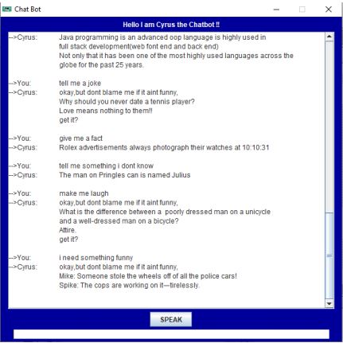
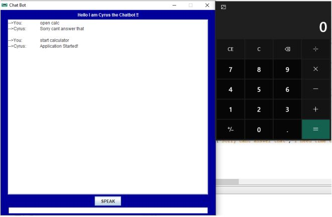
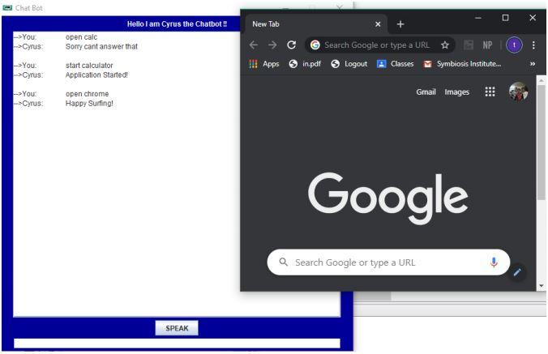
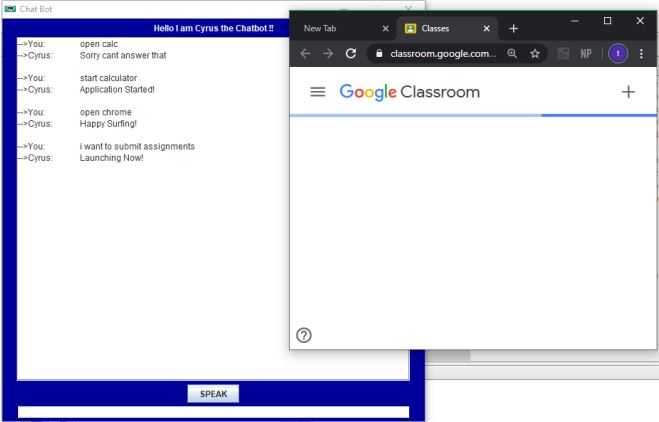
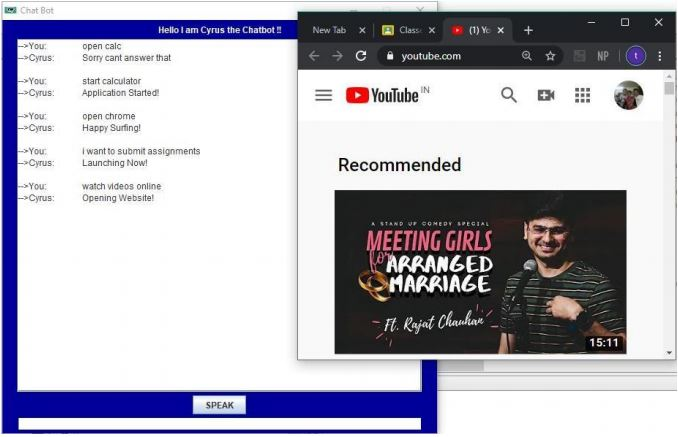
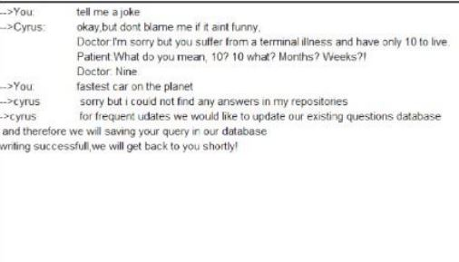
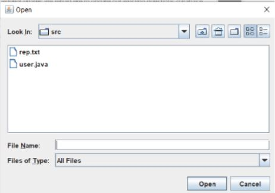

[![MIT License][license-shield]][license-url]
[![LinkedIn][linkedin-shield]][linkedin-url]

<!-- PROJECT LOGO -->
 

  

  <h3 align="center">Cyrus : The ChatBot</h3>

  

    A chatbot for your computer. Inspired by Jarvis!
     
     
    <a href="https://github.com/Himank-J/">Report Bug</a>
    ·
    <a href="https://github.com/Himank-J/">Request Feature</a>
  

<!-- TABLE OF CONTENTS -->
## Table of Contents

* [About the Project](#about-the-project)
  * [Built With](#built-with)
* [Features](#features)
* [Purpose](#purpose)
* [Future Scope](#future-scope)
* [Contributing](#contributing)
* [License](#license)
* [Contact](#contact)

<!-- ABOUT THE PROJECT -->
## About The Project
**NOTE - Refer Chatbot_final report for more details on this project**

 

Chatbots, or conversational interfaces as they are also known, present a new way for 
individuals to interact with computer systems. Traditionally, to get a question answered by a 
software program involved using a search engine, or filling out a form. A chatbot allows a user 
to simply ask questions in the same manner that they would address a human.
Chat bot can be segregated into 2 broad categories.

  
❖ Using AI to implement multiple chatbot functionalities
  
❖ Using mapping technique to correlate with what the user has given as input to find out 
the apt answer from the pre-existing set of database in the form of a Dynamic memory 
allocation like linked list or even in static data structures like arrays.

In this project, I have implemented the second approach to make our chatbot run successfully 
and answer the users query.We have used String Array to store all the possible inputs that user 
can give to us and mapped it into another array that holds the answer to those questions.We use 
a simple analogous equation code to find out the length match comparison of the query given 
as input,match it with our question sets array on the basis of length,keywords used and then 
find out weather we have the question feeded into our database or not.If we do, then with 
another analogous code equation we find the answer associated with the query entered by the 
user and display.

### Built With
This application is built with love, dedication, coffee and **JAVA** programming language.

# Features

Our chat bot also has multiple functionalities such as:
  
❖ The user can access the home windows applications like calculator and even search for 
anything on the internet by just writing phrases like: “open calc” or “search testla”.
  
❖ We have also given our chatbot a voice to make the user feel that the chatbot is more 
alive than just lines of code.
  
❖ We have also include a contingency for when the user’s query cannot be answered by 
the chatbot,in such cases we store the query given as an input by the user to us in a text 
file and ask for their permission to save their entries so that we can diversify the range 
of responsiveness of the chat bot.

<!-- Purpose -->
# Purpose 

The purpose of this project is to develop a fancy services of a chatbot using java services and swing UI. The aim was to implement as many features possible in a chatb ot using simple java language and compare it with a basic chatbot built using advanced technology like AI.

  
<!-- Future Scope -->
# Future Scope
❖ With our program being currently implemented on java using the swing UI, I plan to expand it 
to make our chatbot compatible with:

• Android / iOS devices.

• Execute it on a working website.
  
❖ I have currently used array data structures to store our queries and their respective responses. The
plan is to rebuild that segment of the code by using RDBMS to store both the queries and the 
replies so that we can easily access the database and also make the code immutable to the user.
  
❖ This project can be incorporated with latest technology like Machine learning or Artificial 
intelligence to introduce several creative features like sentimental analysis where chatbot will 
reply according to the mood of user as interpreted from his/her input

<!-- CONTRIBUTING -->
## Contributing

Contributions are what make the open source community such an amazing place to be learn, inspire, and create. Any contributions you make are **greatly appreciated**.

1. Fork the Project
2. Create your Feature Branch (`git checkout -b feature/AmazingFeature`)
3. Commit your Changes (`git commit -m 'Add some AmazingFeature'`)
4. Push to the Branch (`git push origin feature/AmazingFeature`)
5. Open a Pull Request

<!-- LICENSE -->
## License

Distributed under the MIT License. See `LICENSE` for more information.

<!-- CONTACT -->
## Contact

Himank Jain - [@callme__hj](https://instagram.com/callme__hj) - My Instagram  
Himank Jain - [himank-jain](https://www.linkedin.com/in/himank-jain/) - My LinkedIn   
Project Link: [https://github.com/Himank-J/Chatbot](https://github.com/Himank-J/Chatbot-)

<!-- MARKDOWN LINKS & IMAGES -->
<!-- https://www.markdownguide.org/basic-syntax/#reference-style-links -->

[license-shield]: https://img.shields.io/github/license/othneildrew/Best-README-Template.svg?style=flat-square
[license-url]: https://github.com/othneildrew/Best-README-Template/blob/master/LICENSE.txt
[linkedin-shield]: https://img.shields.io/badge/-LinkedIn-black.svg?style=flat-square&logo=linkedin&colorB=555
[linkedin-url]: https://www.linkedin.com/in/himank-jain/
[product-screenshot]: images/search.png
